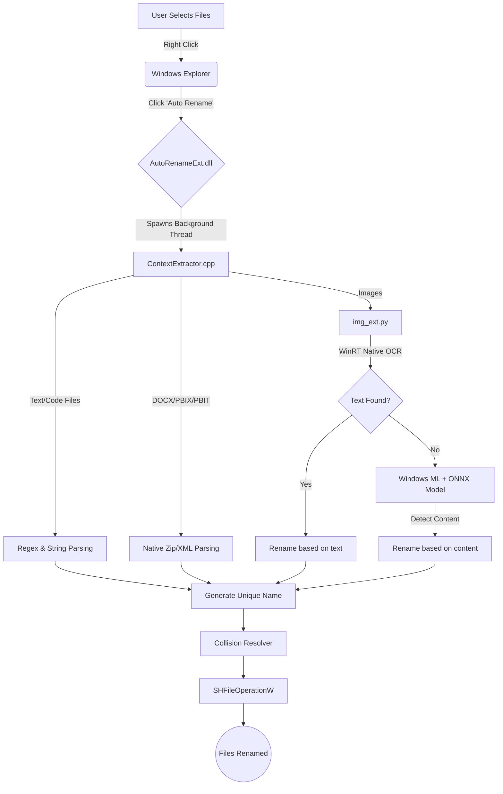

<div align="center">
  
  <h1>Windows Context-Aware File Renamer</h1>
  <p><strong>A Windows Shell Extension that autonomously renames files based on local OCR, ONNX models, and text extraction.</strong></p>
  
  [](https://microsoft.com)
  [](https://isocpp.org/)
  [](https://python.org)
  [](LICENSE)
</div>

<br/>

### Demo
<video src="https://github.com/vishwajittidke/Windows-Context-Aware-File-Renamer/raw/master/Assets/Auto%20Rename%20Demo.mp4" controls="controls" muted="muted" style="max-width: 100%; border-radius: 8px;"></video>

---

## Features

- **Context-Aware Naming**: Extracts content from PDF, DOCX, PBIX, TXT, and images.
- **Native Integration**: Implemented as a C++ COM Shell Extension.
- **Non-Blocking**: Processing occurs on detached background threads.
- **Collision Handling**: Automatically resolves duplicate filenames.
- **Local AI**: Uses WinRT OCR API and local ONNX models. No external network calls.
- **Safe State Handling**: Employs `SHFileOperationW` to support Undo (`Ctrl+Z`) and silently ignore locked files.

---

## Architecture



---

## Prerequisites

1. **OS**: Windows 10 / 11 (64-bit)
2. **Runtime**: Python 3.10+ (In system PATH)
3. **Compiler**: Visual Studio Build Tools (C++ Desktop Development, MSVC, Windows SDK)
4. **Dependencies**: `pip install winsdk numpy pillow`

---

## Installation & Build

**1. Build**
```powershell
mkdir build
cd build
cmake ..
cmake --build . --config Release
```

**2. Register DLL**
```powershell
cd Release
regsvr32 AutoRename.dll
```

**3. Restart Explorer**
```powershell
Stop-Process -Name explorer -Force
```

---

## Usage

1. Select files in Explorer.
2. Right-click and select **Auto Rename** (Under "Show more options" in Win 11).
3. Files rename in the background.

To uninstall:
```powershell
regsvr32 /u AutoRename.dll
Stop-Process -Name explorer -Force
```
