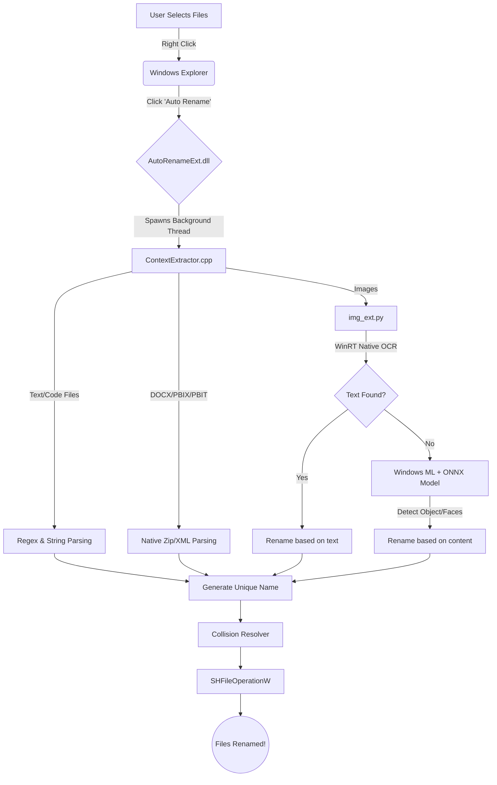

<div align="center">
  
  <h1>🚀 Windows Context-Aware File Renamer</h1>
  <p><strong>A highly intelligent, autonomous Windows Shell Extension that magically renames your files based on their <em>actual contents</em> using local AI models, OCR, and context extraction.</strong></p>
  
  [](https://microsoft.com)
  [](https://isocpp.org/)
  [](https://python.org)
  [](LICENSE)
</div>

<br/>

No more `IMG_1644.jpeg` or `Document_Final_v2.docx`. Select your files, right-click, and let the AI instantly rename them to what they actually are.

### 🎥 Watch it in action:
<video src="https://github.com/vishwajittidke/Windows-Context-Aware-File-Renamer/raw/master/Assets/Auto%20Rename%20Demo.mp4" controls="controls" muted="muted" style="max-width: 100%; border-radius: 8px;"></video>

---

## ✨ Features

- 🧠 **Context-Aware Naming**: Analyzes the contents of PDFs, Word documents, Code files, Images, and even PowerBI files to determine the most descriptive, accurate file name.
- 💻 **Native Windows Integration**: Built natively into the Windows Context Menu via a high-performance C++ Shell Extension.
- ⚡ **Zero-Latency Processing**: Instantly spawns a background thread to prevent locking the Windows UI.
- 🛡️ **Collision Resolution**: Automatically handles identical file names intelligently (e.g., `Portrait.jpeg`, `Portrait (1).jpeg`).
- 🔒 **100% Native & Offline AI**: Leverages the Windows Runtime (WinRT) Native OCR API and Windows Machine Learning (WinML) with local ONNX models. Zero external API calls. Zero privacy risks.

---

## 🏗️ Architecture Visualization



---

## 🛠️ Prerequisites

To run this application locally from scratch, ensure you have the following installed:

1. **Operating System**: Windows 10 / 11 (64-bit)
2. **Python**: 3.10+ (Must be added to your system PATH)
3. **C++ Tools**: **Visual Studio Build Tools** (You MUST install the "Desktop development with C++" workload containing MSVC and the Windows SDK).
4. **Python Dependencies**:
   Install the required libraries (we recommend doing this in your global environment for the shell extension to easily access it, or set up a system-wide Virtual Environment):
   ```powershell
   pip install winsdk numpy pillow
   ```

---

## 🚀 Installation & Build

### 1. Clone and Compile
Open an Administrator PowerShell window in the root directory:
```powershell
mkdir build
cd build
cmake ..
cmake --build . --config Release
```

### 2. Prepare the Scripts
**Critical Step:** The compiled DLL expects the Python scripts to be exactly located at `..\..\src\` relative to itself. Do not move `AutoRename.dll` out of its `build/Release` folder without also moving the `src/` folder alongside it.

### 3. Register the Shell Extension
Register the newly compiled DLL with the Windows Registry:
```powershell
cd Release
regsvr32 AutoRename.dll
```

### 4. Restart Windows Explorer
To force Windows to load the new context menu entry instantly:
```powershell
Stop-Process -Name explorer -Force
```

---

## 💡 Troubleshooting

If files are not renaming:
1. Ensure your Python installation is accessible via the `python` command in PowerShell.
2. Run the fallback test app directly in your terminal to see real-time error logs:
   ```powershell
   .\build\Release\TestApp.exe "D:\Path\To\Failing\File.jpg"
   ```

---

## 💡 Usage

1. Open **Windows Explorer**.
2. Select one or multiple files you want to rename.
3. **Right-click** the highlighted files.
4. Click **Auto Rename** (Under "Show more options" in Windows 11).
5. Watch the files seamlessly rename themselves in real-time based on their actual contents!

---

> [!NOTE] 
> **Uninstalling**: To completely remove the extension from your system, run `regsvr32 /u AutoRename.dll` as Administrator, and restart Windows Explorer.
