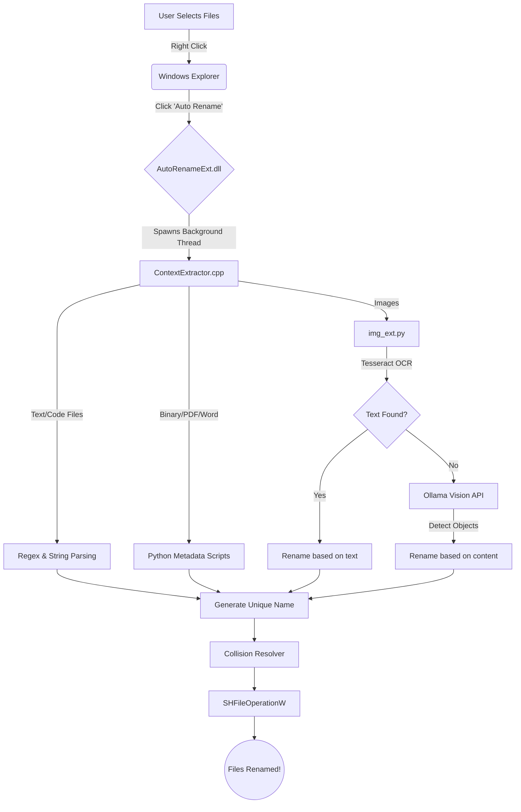

<div align="center">
  
  <h1>🚀 Auto File Rename App</h1>
  <p><strong>A highly intelligent, autonomous Windows Shell Extension that magically renames your files based on their <em>actual contents</em> using local AI models, OCR, and context extraction.</strong></p>
  
  [](https://microsoft.com)
  [](https://isocpp.org/)
  [](https://python.org)
  [](LICENSE)
</div>

<br/>

No more `IMG_1644.jpeg` or `Document_Final_v2.docx`. Select your files, right-click, and let the AI instantly rename them to what they actually are.

---

## ✨ Features

- 🧠 **Context-Aware Naming**: Analyzes the contents of PDFs, Word documents, Code files, Images, and even PowerBI files to determine the most descriptive, accurate file name.
- 💻 **Native Windows Integration**: Built natively into the Windows Context Menu via a high-performance C++ Shell Extension.
- ⚡ **Zero-Latency Processing**: Instantly spawns a background thread to prevent locking the Windows UI.
- 🛡️ **Collision Resolution**: Automatically handles identical file names intelligently (e.g., `Portrait.jpeg`, `Portrait (1).jpeg`).
- 🔒 **Offline & Local AI Support**: Leverages local Tesseract OCR and Ollama Vision models to guarantee complete privacy.

---

## 🏗️ Architecture Visualization



---

## 🛠️ Prerequisites

To run this application locally from scratch, ensure you have the following installed:

1. **Operating System**: Windows 10 / 11 (64-bit)
2. **Python**: 3.10+ (Added to system PATH)
3. **C++ Tools**: CMake and Visual Studio Build Tools
4. **Tesseract OCR**: 
   ```powershell
   winget install -e --id UB-Mannheim.TesseractOCR
   ```
5. **Ollama**: Download and install from [ollama.com](https://ollama.com/), then run:
   ```powershell
   ollama run llama3.2-vision
   ```
6. **Python Dependencies**:
   ```powershell
   pip install pytesseract pillow pypdf2 docx2txt ollama google-genai openai pywinauto mss opencv-python
   ```

---

## 🚀 Installation & Build

### 1. Clone and Compile
Open an Administrator PowerShell window in the root directory:
```powershell
mkdir build
cd build
cmake ..
cmake --build . --config Release
```

### 2. Register the Shell Extension
Register the newly compiled DLL with the Windows Registry:
```powershell
cd Release
regsvr32 AutoRename.dll
```

### 3. Restart Windows Explorer
To force Windows to load the new context menu entry instantly:
```powershell
Stop-Process -Name explorer -Force
```

---

## 💡 Usage

1. Open **Windows Explorer**.
2. Select one or multiple files you want to rename.
3. **Right-click** the highlighted files.
4. Click **Auto Rename** (Under "Show more options" in Windows 11).
5. Watch the files seamlessly rename themselves in real-time based on their actual contents!

---

> [!NOTE] 
> **Uninstalling**: To completely remove the extension from your system, run `regsvr32 /u AutoRename.dll` as Administrator, and restart Windows Explorer.
